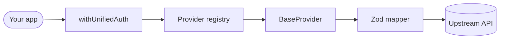

# 🚀 Open IpaaS

**The open-source standard for universal B2B integrations.**

Open IpaaS is a high-performance Next.js framework that unifies communication with any SaaS platform (ERPs, CRMs, e-commerce, accounting, ticketing) behind a single **English-first**, **strongly-typed**, **runtime-validated** API.

Enterprise-grade integrations shouldn't be locked behind closed-source paywalls.

[Website](https://openipaas.com) · [Docs](https://openipaas.com/docs) · [Contributing](#-adding-a-provider)

---

## 💎 Why Open IpaaS?

- 🌍 **English first**: your app speaks one standardized vocabulary. The framework normalizes every upstream system underneath.
- 🛡️ **Zod Shield**: every mapper ends in a runtime parse. If a platform changes its contract without warning, it fails at the boundary instead of corrupting your data.
- 🔌 **Plugin architecture**: a provider is one folder plus one line in the registry. The core never changes.
- 🔁 **Resilient by default**: per account rate limiting, retry with exponential backoff, and refresh-and-replay on expired credentials, for every provider.
- 🔓 **Never blocked**: `/passthrough` exposes the raw provider API with credentials handled, so a missing unified field never stops you.

## 🛠 Architecture



`withUnifiedAuth` handles authentication, rate limiting, idempotency, error translation and request logging. `BaseProvider` handles URL building, throttling, retries, token refresh and passthrough. A provider implementation is left with mappers and endpoint paths.

### Layout

```
src/lib/providers/
  core/               registry, BaseProvider, http, rate-limit, pagination, errors, types
  implementations/
    contaazul/        manifest.ts · provider.ts · mappers/ · types/
    omie/
    tiny/
```

## 🚀 Quick start

```bash
cp .env.example .env      # fill in the values described below
docker-compose up --build # Postgres + migrations + seed + app
```

Then open `http://localhost:3000/docs` for the interactive reference.

### Required environment

| Variable | Purpose |
| --- | --- |
| `DATABASE_URL` | PostgreSQL connection string |
| `CREDENTIALS_ENCRYPTION_KEY` | 32 bytes (base64/hex). Encrypts stored ERP tokens at rest. **Required in production** |
| `DASHBOARD_PASSWORD` + `DASHBOARD_SESSION_SECRET` | Gate the admin console. Without both, `/dashboard` is unreachable |
| `INTERNAL_JOB_SECRET` | Authorizes the webhook delivery job |
| `<SLUG>_CLIENT_ID` / `<SLUG>_CLIENT_SECRET` | OAuth app per provider, e.g. `CONTA_AZUL_CLIENT_ID` |

Generate secrets with `openssl rand -base64 32`.

## 📡 Using the API

Every request carries two headers:

```bash
curl https://your-host/api/unified/v1/customers \
  -H "Authorization: Bearer oip_live_..." \
  -H "X-Account-Token: <connected account token>"
```

**Pagination** is cursor-based and provider-agnostic:

```json
{ "items": [...], "hasMore": true, "nextCursor": "eyJwYWdlIjoyfQ", "totalItems": 120 }
```

Pass `nextCursor` back as `?cursor=`. `totalItems` is best effort, because cursor based upstreams cannot report a total.

**Idempotency**: send `Idempotency-Key` on writes. Retrying with the same key replays the original response; reusing it with a different body returns `422`.

**Errors** carry a stable `code` and a `requestId` (also in `X-Request-Id`). Upstream payloads are logged, never returned.

**Capabilities**: `GET /api/unified/v1/providers` returns the catalog and the exact operation matrix. A `501 NOT_SUPPORTED` means the connected provider lacks that operation, and it is answered before any upstream call.

**Passthrough**, for anything the unified model does not cover:

```bash
curl https://your-host/api/unified/v1/passthrough/pessoas?pagina=1 \
  -H "Authorization: Bearer oip_live_..." \
  -H "X-Account-Token: ..."
```

## ➕ Adding a provider

```bash
npm run generate-provider bling
```

This scaffolds the folder (manifest, provider class, mapper stub, test) and prints the single registry line to add. The generated provider passes the contract suite immediately: it declares no capabilities and enables passthrough, so it is honest about what it can do from day one.

Then:

1. Fill in `manifest.ts`: base URL, auth, rate limit.
2. Implement a method and declare its capability. The contract suite fails if the two disagree, in either direction.
3. `npx vitest run`

The **manifest is the single source of truth**: it drives the public catalog, the connect UI, the OpenAPI capability matrix and the 501 responses. Nothing else needs to know your provider exists.

### Supported providers

| Provider | Category | Auth | Status |
| --- | --- | --- | --- |
| Conta Azul | Accounting | OAuth2 | Customers, products, sales, sellers, PDF, bulk |
| Omie | Accounting | App key/secret | Customers · passthrough |
| Tiny (Olist) | Accounting | OAuth2 | Passthrough only |

## 🔒 Security

- ERP credentials are encrypted at rest (AES-256-GCM).
- API keys are stored as SHA-256 digests, so the plaintext is shown once, at creation.
- OAuth uses single-use, time-limited server-side `state` (PKCE available per manifest).
- The unified API is rate limited per client; each provider is throttled per connected account.
- Upstream error payloads never reach API consumers.

## 🧪 Tests

```bash
npm test
```

The contract suite in `src/tests/providers/contract.test.ts` runs against **every registered provider**, so a contribution either satisfies the shared contract or the build fails.

## 🤝 Contributing

We want the largest open source catalog of B2B integrations in the world, from
obscure local accounting systems to global CRM giants. The plugin architecture is
designed so that adding one costs a folder, not a refactor.

Start with [CONTRIBUTING.md](CONTRIBUTING.md). Commits need a
[DCO sign off](CONTRIBUTING.md#license-and-the-dco), which `git commit -s` adds
for you.

## 📄 License

[Apache License 2.0](LICENSE). Use it commercially, modify it, self host it, ship
it inside your product. The only obligations, and only when you redistribute, are
to keep the notices and state your changes.

Apache 2.0 rather than MIT for the express patent grant, which is what lets a
corporate legal review approve it without an argument.
See [docs/LICENSING.md](docs/LICENSING.md) for the reasoning.
